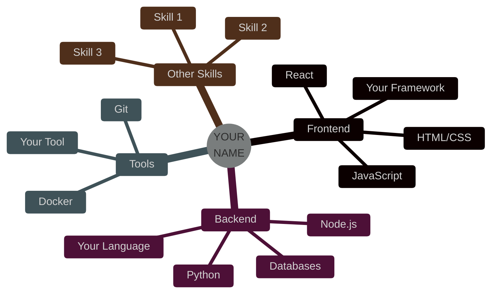

<!-- 
╔══════════════════════════════════════════════════════════════════════════════╗
║                                                                              ║
║               🚀 ULTIMATE GITHUB PROFILE README TEMPLATE 🚀                  ║
║                          ⭐ GOD-TIER EDITION ⭐                              ║
║                                                                              ║
║  📝 UNIVERSAL TEMPLATE - FULLY CUSTOMIZABLE FOR ANYONE                       ║
║  🎯 EASY TO USE - JUST FOLLOW THE COMMENTS AND REPLACE VALUES               ║
║  💎 PROFESSIONAL GRADE - IMPRESS RECRUITERS & COLLABORATORS                 ║
║  🔥 BATTLE-TESTED - PROVEN TO GET ATTENTION                                 ║
║                                                                              ║
╚══════════════════════════════════════════════════════════════════════════════╝

┌──────────────────────────────────────────────────────────────────────────────┐
│                          📋 QUICK START GUIDE                                 │
└──────────────────────────────────────────────────────────────────────────────┘

✅ STEP 1: FIND & REPLACE THESE VALUES THROUGHOUT THE FILE:
   • YOUR_GITHUB_USERNAME    → Replace with your GitHub username (e.g., "john-doe")
   • YOUR_NAME               → Replace with your full name (e.g., "John Doe")
   • YOUR_TITLE              → Replace with your role (e.g., "Full Stack Developer")
   • YOUR_LOCATION           → Replace with your location (e.g., "USA 🇺🇸")
   • YOUR_UNIVERSITY         → Replace with your school/university

✅ STEP 2: UPDATE CONTACT INFORMATION:
   • LinkedIn URL
   • Email address
   • Twitter/X handle
   • Portfolio website
   • Other social media links

✅ STEP 3: CUSTOMIZE TECH STACK:
   • Add/remove technology badges that match your skills
   • Keep only the technologies you actually use

✅ STEP 4: UPDATE PROJECTS:
   • Replace project names and descriptions
   • Update GitHub repository links
   • Add your actual project demos

✅ STEP 5: PERSONALIZE CONTENT:
   • Update the "About Me" code block
   • Modify achievements table
   • Change quotes and personal touch

┌──────────────────────────────────────────────────────────────────────────────┐
│                          🎨 CUSTOMIZATION TIPS                                │
└──────────────────────────────────────────────────────────────────────────────┘

🎨 COLOR THEMES:
   • Change "00D9FF" (cyan) to your favorite color (hex without #)
   • Popular options:
     - 00D9FF = Cyan (Tech/Modern)
     - FF6B6B = Red (Bold/Energetic)  
     - 4CAF50 = Green (Fresh/Growth)
     - FFD700 = Gold (Premium/Luxury)
     - 9D4EDD = Purple (Creative/Unique)
     - FF6F00 = Orange (Warm/Friendly)

🔧 ADVANCED CUSTOMIZATION:
   • Change gradient colors in header/footer (customColorList parameter)
   • Modify animation speeds (duration parameter)
   • Adjust sizing (height, width parameters)

💡 PRO TIPS:
   • Use CTRL+F (Windows) or CMD+F (Mac) to find and replace all instances
   • Keep your README updated regularly
   • Remove sections you don't need
   • Add custom GIFs that represent your personality
   • Test your README in GitHub preview before committing

┌──────────────────────────────────────────────────────────────────────────────┐
│                     🎯 SECTIONS INCLUDED IN THIS TEMPLATE                     │
└──────────────────────────────────────────────────────────────────────────────┘

✨ Animated header with your name
✨ Dynamic typing effect
✨ Profile statistics badges  
✨ About me code block
✨ Comprehensive tech stack showcase
✨ Featured projects gallery
✨ GitHub statistics and analytics
✨ Contribution graphs and streaks
✨ Trophy collection
✨ Achievements table
✨ Skill progression diagram
✨ Social media links
✨ Random quotes and jokes
✨ Spotify integration (optional)
✨ Support section
✨ Professional footer

Ready? Let's make your profile LEGENDARY! 🔥

-->

<div align="center">

<!-- 
┏━━━━━━━━━━━━━━━━━━━━━━━━━━━━━━━━━━━━━━━━━━━━━━━━━━━━━━━━━━━━━━━━━━━━━━━━━━━┓
┃  SECTION 1: ANIMATED HEADER                                                  ┃
┃  🔧 REPLACE: "YOUR_NAME" with your actual name                               ┃
┃  🔧 REPLACE: "YOUR_TITLE" with your job title/description                    ┃
┃  💡 TIP: Keep text short for better display on mobile                        ┃
┗━━━━━━━━━━━━━━━━━━━━━━━━━━━━━━━━━━━━━━━━━━━━━━━━━━━━━━━━━━━━━━━━━━━━━━━━━━━┛
-->

<!-- 🔽 REPLACE "YOUR_NAME" BELOW 🔽 -->


<!-- 
┏━━━━━━━━━━━━━━━━━━━━━━━━━━━━━━━━━━━━━━━━━━━━━━━━━━━━━━━━━━━━━━━━━━━━━━━━━━━┓
┃  SECTION 2: DYNAMIC TYPING ANIMATION                                         ┃
┃  🔧 CUSTOMIZE: Edit the "lines=" parameter to change text                    ┃
┃  💡 TIP: Separate different lines with semicolons (;)                        ┃
┃  💡 TIP: Use + for spaces in URLs                                            ┃
┗━━━━━━━━━━━━━━━━━━━━━━━━━━━━━━━━━━━━━━━━━━━━━━━━━━━━━━━━━━━━━━━━━━━━━━━━━━━┛
-->

<!-- 🔽 CUSTOMIZE YOUR ANIMATED TEXT BELOW 🔽 -->
<p align="center">
  
</p>

<!-- NEON DIVIDER -->


<!-- 
┏━━━━━━━━━━━━━━━━━━━━━━━━━━━━━━━━━━━━━━━━━━━━━━━━━━━━━━━━━━━━━━━━━━━━━━━━━━━┓
┃  SECTION 3: STATISTICS BADGES                                                ┃
┃  🔧 REPLACE: "YOUR_GITHUB_USERNAME" with your actual GitHub username         ┃
┃  💡 TIP: These badges update automatically based on your GitHub activity     ┃
┗━━━━━━━━━━━━━━━━━━━━━━━━━━━━━━━━━━━━━━━━━━━━━━━━━━━━━━━━━━━━━━━━━━━━━━━━━━━┛
-->

<!-- 🔽 REPLACE "YOUR_GITHUB_USERNAME" IN ALL BADGES BELOW 🔽 -->
<p align="center">
  
  
  
  
  
</p>

<!-- 3D ANIMATED AVATAR -->
<p align="center">
  
</p>

</div>

---

<!-- 
┏━━━━━━━━━━━━━━━━━━━━━━━━━━━━━━━━━━━━━━━━━━━━━━━━━━━━━━━━━━━━━━━━━━━━━━━━━━━┓
┃  SECTION 4: ABOUT ME / PROFILE                                               ┃
┃  🔧 REPLACE: All personal information in the code block                      ┃
┃  🔧 CUSTOMIZE: Change the variable name from "yourName" to match you         ┃
┃  💡 TIP: This creates a cool developer-style bio                             ┃
┗━━━━━━━━━━━━━━━━━━━━━━━━━━━━━━━━━━━━━━━━━━━━━━━━━━━━━━━━━━━━━━━━━━━━━━━━━━━┛
-->


##  **ABOUT ME**

<!-- 🔽 REPLACE ALL INFORMATION BELOW WITH YOUR OWN 🔽 -->
```typescript
interface Developer {
  name: string;
  role: string[];
  location: string;
  education: string;
  expertise: string[];
  currentMission: string;
  superPower: string;
}

// 🔽 REPLACE "yourName" and all values with your information 🔽
const yourName: Developer = {
  name: "YOUR_NAME",                                    // 🔧 Your full name
  role: ["YOUR_TITLE", "Your Second Role"],            // 🔧 Your job titles
  location: "YOUR_LOCATION | YOUR_UNIVERSITY",         // 🔧 Your location & school
  education: "YOUR_DEGREE",                            // 🔧 Your degree/major
  expertise: [
    "YOUR_SKILL_1",                                    // 🔧 Add your skills
    "YOUR_SKILL_2",
    "YOUR_SKILL_3",
    "YOUR_SKILL_4",
    "YOUR_SKILL_5",
    // Add more skills as needed
  ],
  currentMission: "YOUR_CURRENT_GOAL 🚀",              // 🔧 What you're working on
  superPower: "YOUR_SUPERPOWER ☕ → 💻"                // 🔧 Your unique trait
};

// Achievement Unlocked: God Tier Developer 🏆
console.log(`${yourName.name} is online and ready to revolutionize tech! 🚀`);
```


<!-- 
┏━━━━━━━━━━━━━━━━━━━━━━━━━━━━━━━━━━━━━━━━━━━━━━━━━━━━━━━━━━━━━━━━━━━━━━━━━━━┓
┃  SECTION 5: TECH STACK                                                       ┃
┃  🔧 CUSTOMIZE: Add/remove badges based on YOUR actual skills                 ┃
┃  💡 TIP: Only include technologies you're comfortable with                   ┃
┃  💡 TIP: Find more badges at shields.io                                      ┃
┃  💡 TIP: Remove entire sections if not applicable                            ┃
┗━━━━━━━━━━━━━━━━━━━━━━━━━━━━━━━━━━━━━━━━━━━━━━━━━━━━━━━━━━━━━━━━━━━━━━━━━━━┛
-->

##  **TECH STACK**

<div align="center">

### ⚡ **FRONTEND DEVELOPMENT** ⚡
<!-- 🔽 KEEP ONLY THE TECHNOLOGIES YOU USE 🔽 -->
<p>
  
  
  
  
  
  
  
  
  
  
  
  
  
  
</p>

### 🔥 **BACKEND DEVELOPMENT** 🔥
<!-- 🔽 KEEP ONLY THE TECHNOLOGIES YOU USE 🔽 -->
<p>
  
  
  
  
  
  
  
  
  
  
  
  
  
  
</p>

### 🤖 **AI/ML & DATA SCIENCE** 🤖
<!-- 🔽 REMOVE THIS SECTION IF YOU DON'T WORK WITH AI/ML 🔽 -->
<p>
  
  
  
  
  
  
  
  
  
  
  
</p>

### 💾 **DATABASES** 💾
<!-- 🔽 KEEP ONLY THE DATABASES YOU USE 🔽 -->
<p>
  
  
  
  
  
  
  
  
  
</p>

### ☁️ **CLOUD & DEVOPS** ☁️
<!-- 🔽 KEEP ONLY THE PLATFORMS/TOOLS YOU USE 🔽 -->
<p>
  
  
  
  
  
  
  
  
  
  
  
  
</p>

### 🛠️ **TOOLS & TECHNOLOGIES** 🛠️
<!-- 🔽 KEEP ONLY THE TOOLS YOU USE 🔽 -->
<p>
  
  
  
  
  
  
  
  
  
  
  
  
  
</p>

### 📱 **MOBILE DEVELOPMENT** 📱
<!-- 🔽 REMOVE THIS SECTION IF YOU DON'T DO MOBILE DEV 🔽 -->
<p>
  
  
  
  
  
  
</p>

</div>


<!-- 
┏━━━━━━━━━━━━━━━━━━━━━━━━━━━━━━━━━━━━━━━━━━━━━━━━━━━━━━━━━━━━━━━━━━━━━━━━━━━┓
┃  SECTION 6: FEATURED PROJECTS                                                ┃
┃  🔧 REPLACE: All project information with YOUR actual projects               ┃
┃  🔧 UPDATE: GitHub links to your repositories                                ┃
┃  🔧 UPDATE: Demo links to your live projects                                 ┃
┃  💡 TIP: Showcase your 4-6 best projects                                     ┃
┃  💡 TIP: You can add/remove project cards as needed                          ┃
┗━━━━━━━━━━━━━━━━━━━━━━━━━━━━━━━━━━━━━━━━━━━━━━━━━━━━━━━━━━━━━━━━━━━━━━━━━━━┛
-->

##  **FEATURED PROJECTS**

<div align="center">

### 🌟 **MY BEST WORK** 🌟

<table>
<tr>
<td width="50%" valign="top">

<!-- 🔽 PROJECT 1 - REPLACE WITH YOUR PROJECT 🔽 -->
#### 🚀 **YOUR PROJECT NAME 1**


**Tech Stack:** Technology 1 • Technology 2 • Technology 3

✨ Feature/benefit 1  
✨ Feature/benefit 2  
✨ Feature/benefit 3  
✨ Feature/benefit 4

<!-- 🔧 UPDATE YOUR GITHUB AND DEMO LINKS BELOW -->
<a href="https://github.com/YOUR_GITHUB_USERNAME/YOUR_REPO"></a>
<a href="YOUR_DEMO_LINK"></a>

</td>

<td width="50%" valign="top">

<!-- 🔽 PROJECT 2 - REPLACE WITH YOUR PROJECT 🔽 -->
#### 🎨 **YOUR PROJECT NAME 2**


**Tech Stack:** Technology 1 • Technology 2 • Technology 3

✨ Feature/benefit 1  
✨ Feature/benefit 2  
✨ Feature/benefit 3  
✨ Feature/benefit 4

<!-- 🔧 UPDATE YOUR GITHUB AND DEMO LINKS BELOW -->
<a href="https://github.com/YOUR_GITHUB_USERNAME/YOUR_REPO"></a>
<a href="YOUR_DEMO_LINK"></a>

</td>
</tr>

<tr>
<td width="50%" valign="top">

<!-- 🔽 PROJECT 3 - REPLACE WITH YOUR PROJECT 🔽 -->
#### 🧠 **YOUR PROJECT NAME 3**


**Tech Stack:** Technology 1 • Technology 2 • Technology 3

✨ Feature/benefit 1  
✨ Feature/benefit 2  
✨ Feature/benefit 3  
✨ Feature/benefit 4

<!-- 🔧 UPDATE YOUR GITHUB AND DEMO LINKS BELOW -->
<a href="https://github.com/YOUR_GITHUB_USERNAME/YOUR_REPO"></a>
<a href="YOUR_DEMO_LINK"></a>

</td>

<td width="50%" valign="top">

<!-- 🔽 PROJECT 4 - REPLACE WITH YOUR PROJECT 🔽 -->
#### 💼 **YOUR PROJECT NAME 4**


**Tech Stack:** Technology 1 • Technology 2 • Technology 3

✨ Feature/benefit 1  
✨ Feature/benefit 2  
✨ Feature/benefit 3  
✨ Feature/benefit 4

<!-- 🔧 UPDATE YOUR GITHUB AND DEMO LINKS BELOW -->
<a href="https://github.com/YOUR_GITHUB_USERNAME/YOUR_REPO"></a>
<a href="YOUR_DEMO_LINK"></a>

</td>
</tr>

<!-- 
💡 OPTIONAL: ADD MORE PROJECTS BY COPYING THE ABOVE PATTERN
💡 TIP: You can add another <tr> row for projects 5 & 6
-->

</table>

<!-- 🔽 UPDATE THESE STATISTICS WITH YOUR ACTUAL NUMBERS 🔽 -->


</div>


<!-- 
┏━━━━━━━━━━━━━━━━━━━━━━━━━━━━━━━━━━━━━━━━━━━━━━━━━━━━━━━━━━━━━━━━━━━━━━━━━━━┓
┃  SECTION 7: GITHUB STATISTICS                                                ┃
┃  🔧 REPLACE: "YOUR_GITHUB_USERNAME" in ALL stat URLs                         ┃
┃  💡 TIP: These cards update automatically from your GitHub data              ┃
┃  💡 TIP: You can customize themes by changing theme= parameter               ┃
┗━━━━━━━━━━━━━━━━━━━━━━━━━━━━━━━━━━━━━━━━━━━━━━━━━━━━━━━━━━━━━━━━━━━━━━━━━━━┛
-->

##  **GITHUB STATISTICS**

<div align="center">

<!-- 🔽 REPLACE "YOUR_GITHUB_USERNAME" IN ALL URLS BELOW 🔽 -->

<!-- Contribution Graph -->


<!-- GitHub Stats and Streak -->
<table>
<tr>
<td width="50%">

</td>
<td width="50%">

</td>
</tr>
</table>

<!-- Profile Details -->


<!-- Top Languages and Productive Time -->
<table>
<tr>
<td width="50%">

</td>
<td width="50%">

</td>
</tr>
</table>

<!-- GitHub Trophies -->


</div>


<!-- 
┏━━━━━━━━━━━━━━━━━━━━━━━━━━━━━━━━━━━━━━━━━━━━━━━━━━━━━━━━━━━━━━━━━━━━━━━━━━━┓
┃  SECTION 8: CONTRIBUTION SNAKE (OPTIONAL)                                    ┃
┃  🔧 REPLACE: "YOUR_GITHUB_USERNAME" if you set up the snake animation        ┃
┃  💡 TIP: This requires GitHub Actions setup - remove section if not needed   ┃
┗━━━━━━━━━━━━━━━━━━━━━━━━━━━━━━━━━━━━━━━━━━━━━━━━━━━━━━━━━━━━━━━━━━━━━━━━━━━┛
-->

## 🐍 **CONTRIBUTION SNAKE**

<picture>
  <source media="(prefers-color-scheme: dark)" srcset="https://raw.githubusercontent.com/YOUR_GITHUB_USERNAME/YOUR_GITHUB_USERNAME/output/github-contribution-grid-snake-dark.svg">
  <source media="(prefers-color-scheme: light)" srcset="https://raw.githubusercontent.com/YOUR_GITHUB_USERNAME/YOUR_GITHUB_USERNAME/output/github-contribution-grid-snake.svg">
  
</picture>


<!-- 
┏━━━━━━━━━━━━━━━━━━━━━━━━━━━━━━━━━━━━━━━━━━━━━━━━━━━━━━━━━━━━━━━━━━━━━━━━━━━┓
┃  SECTION 9: ACHIEVEMENTS TABLE                                               ┃
┃  🔧 CUSTOMIZE: Replace with YOUR actual achievements                         ┃
┃  💡 TIP: Be honest - only include real accomplishments                       ┃
┃  💡 TIP: Remove this section if you're just starting out                     ┃
┗━━━━━━━━━━━━━━━━━━━━━━━━━━━━━━━━━━━━━━━━━━━━━━━━━━━━━━━━━━━━━━━━━━━━━━━━━━━┛
-->

## 🏆 **ACHIEVEMENTS & MILESTONES**

<div align="center">

<!-- 🔽 REPLACE WITH YOUR ACTUAL ACHIEVEMENTS 🔽 -->
| 🎯 **MILESTONE** | 🔥 **STATUS** | 💎 **LEVEL** | 📈 **IMPACT** |
|:----------------|:-------------|:------------|:-------------|
| Projects Completed | ✅ **YOUR_NUMBER** | ⭐⭐⭐⭐⭐ | Production Ready |
| Code Quality Score | ✅ **YOUR_%** | ⭐⭐⭐⭐⭐ | High Standards |
| Open Source Contributions | ✅ **YOUR_NUMBER** | ⭐⭐⭐⭐ | Community Active |
| Certifications Earned | ✅ **YOUR_NUMBER** | ⭐⭐⭐⭐ | Verified Skills |
| Hackathon Participations | ✅ **YOUR_NUMBER** | ⭐⭐⭐⭐ | Competitive |
| Tech Articles Written | ✅ **YOUR_NUMBER** | ⭐⭐⭐⭐ | Knowledge Sharing |
| Students Mentored | ✅ **YOUR_NUMBER** | ⭐⭐⭐⭐ | Giving Back |

<!-- 🔽 CUSTOMIZE THESE BADGES WITH YOUR INFO 🔽 -->


</div>


<!-- 
┏━━━━━━━━━━━━━━━━━━━━━━━━━━━━━━━━━━━━━━━━━━━━━━━━━━━━━━━━━━━━━━━━━━━━━━━━━━━┓
┃  SECTION 10: SKILL PROGRESSION (OPTIONAL)                                    ┃
┃  🔧 CUSTOMIZE: Edit the Mermaid diagram with YOUR skills                     ┃
┃  💡 TIP: This creates a cool mind map of your expertise                      ┃
┃  💡 TIP: You can remove this section if you prefer                           ┃
┗━━━━━━━━━━━━━━━━━━━━━━━━━━━━━━━━━━━━━━━━━━━━━━━━━━━━━━━━━━━━━━━━━━━━━━━━━━━┛
-->

## 📊 **SKILL PROGRESSION**

<div align="center">

<!-- 🔽 CUSTOMIZE THE SKILL CATEGORIES AND ITEMS BELOW 🔽 -->


</div>


<!-- 
┏━━━━━━━━━━━━━━━━━━━━━━━━━━━━━━━━━━━━━━━━━━━━━━━━━━━━━━━━━━━━━━━━━━━━━━━━━━━┓
┃  SECTION 11: SOCIAL LINKS & CONTACT                                          ┃
┃  🔧 REPLACE: ALL social media links with your actual profiles                ┃
┃  💡 TIP: Remove social media buttons you don't use                           ┃
┃  💡 TIP: Add any other platforms you're active on                            ┃
┗━━━━━━━━━━━━━━━━━━━━━━━━━━━━━━━━━━━━━━━━━━━━━━━━━━━━━━━━━━━━━━━━━━━━━━━━━━━┛
-->

## 🌐 **LET'S CONNECT**

<div align="center">

<!-- 🔽 REPLACE ALL LINKS BELOW WITH YOUR ACTUAL PROFILES 🔽 -->

<a href="https://linkedin.com/in/YOUR_LINKEDIN_USERNAME" target="_blank">

</a>

<a href="https://github.com/YOUR_GITHUB_USERNAME" target="_blank">

</a>

<a href="mailto:YOUR_EMAIL@example.com">

</a>

<a href="https://twitter.com/YOUR_TWITTER_HANDLE" target="_blank">

</a>

<a href="https://YOUR_PORTFOLIO_WEBSITE.com" target="_blank">

</a>

<!-- 🔽 OPTIONAL: ADD MORE SOCIAL LINKS 🔽 -->
<a href="https://medium.com/@YOUR_MEDIUM_USERNAME" target="_blank">

</a>

<a href="https://dev.to/YOUR_DEVTO_USERNAME" target="_blank">

</a>

<a href="https://stackoverflow.com/users/YOUR_SO_ID" target="_blank">

</a>

<a href="https://leetcode.com/YOUR_LEETCODE_USERNAME" target="_blank">

</a>

<a href="https://www.youtube.com/@YOUR_YOUTUBE_CHANNEL" target="_blank">

</a>

<a href="https://discord.com/users/YOUR_DISCORD_ID" target="_blank">

</a>

### 💬 **OPEN TO COLLABORATIONS & OPPORTUNITIES**


</div>


<!-- 
┏━━━━━━━━━━━━━━━━━━━━━━━━━━━━━━━━━━━━━━━━━━━━━━━━━━━━━━━━━━━━━━━━━━━━━━━━━━━┓
┃  SECTION 12: QUOTE & JOKES (OPTIONAL)                                        ┃
┃  💡 TIP: These widgets update automatically                                  ┃
┃  💡 TIP: You can remove this section if you prefer a more serious profile    ┃
┗━━━━━━━━━━━━━━━━━━━━━━━━━━━━━━━━━━━━━━━━━━━━━━━━━━━━━━━━━━━━━━━━━━━━━━━━━━━┛
-->

<div align="center">

### 💭 **RANDOM DEV QUOTE**


### 😂 **DEV HUMOR**


</div>


<!-- 
┏━━━━━━━━━━━━━━━━━━━━━━━━━━━━━━━━━━━━━━━━━━━━━━━━━━━━━━━━━━━━━━━━━━━━━━━━━━━┓
┃  SECTION 13: RECENT ACTIVITY (OPTIONAL)                                      ┃
┃  🔧 SETUP: Requires GitHub Actions workflow                                  ┃
┃  💡 TIP: Remove this section if you don't want to set up the workflow        ┃
┗━━━━━━━━━━━━━━━━━━━━━━━━━━━━━━━━━━━━━━━━━━━━━━━━━━━━━━━━━━━━━━━━━━━━━━━━━━━┛
-->

<div align="center">

### 📈 **RECENT ACTIVITY**

<!--START_SECTION:activity-->
<!-- This section will be automatically updated by GitHub Actions -->
<!-- Setup instructions: https://github.com/jamesgeorge007/github-activity-readme -->
<!--END_SECTION:activity-->

</div>


<!-- 
┏━━━━━━━━━━━━━━━━━━━━━━━━━━━━━━━━━━━━━━━━━━━━━━━━━━━━━━━━━━━━━━━━━━━━━━━━━━━┓
┃  SECTION 14: SPOTIFY NOW PLAYING (OPTIONAL)                                  ┃
┃  🔧 REPLACE: "YOUR_SPOTIFY_ID" with your Spotify user ID                     ┃
┃  💡 TIP: Find your Spotify ID at: https://www.spotify.com/account/          ┃
┃  💡 TIP: Remove this section if you don't want to show music                 ┃
┗━━━━━━━━━━━━━━━━━━━━━━━━━━━━━━━━━━━━━━━━━━━━━━━━━━━━━━━━━━━━━━━━━━━━━━━━━━━┛
-->

<div align="center">

### 🎵 **CURRENTLY VIBING TO**

<!-- 🔽 REPLACE "YOUR_SPOTIFY_ID" BELOW 🔽 -->
<a href="https://spotify-github-profile.vercel.app/api/view?uid=YOUR_SPOTIFY_ID&redirect=true">

</a>

</div>


<!-- 
┏━━━━━━━━━━━━━━━━━━━━━━━━━━━━━━━━━━━━━━━━━━━━━━━━━━━━━━━━━━━━━━━━━━━━━━━━━━━┓
┃  SECTION 15: SUPPORT/COFFEE (OPTIONAL)                                       ┃
┃  🔧 REPLACE: Your Buy Me a Coffee username                                   ┃
┃  💡 TIP: Remove this section if you don't have/want donation support         ┃
┗━━━━━━━━━━━━━━━━━━━━━━━━━━━━━━━━━━━━━━━━━━━━━━━━━━━━━━━━━━━━━━━━━━━━━━━━━━━┛
-->

<div align="center">

### ☕ **SUPPORT MY WORK**

If you find my projects helpful, consider buying me a coffee!

<!-- 🔽 REPLACE "YOUR_BUYMEACOFFEE_USERNAME" BELOW 🔽 -->
<a href="https://www.buymeacoffee.com/YOUR_BUYMEACOFFEE_USERNAME" target="_blank">

</a>

</div>


<!-- 
┏━━━━━━━━━━━━━━━━━━━━━━━━━━━━━━━━━━━━━━━━━━━━━━━━━━━━━━━━━━━━━━━━━━━━━━━━━━━┓
┃  SECTION 16: FOOTER                                                          ┃
┃  🔧 REPLACE: "YOUR_NAME" with your actual name                               ┃
┃  🔧 REPLACE: "YOUR_GITHUB_USERNAME" for the visitor counter                  ┃
┃  💡 TIP: Customize the quote or tagline to match your personality            ┃
┗━━━━━━━━━━━━━━━━━━━━━━━━━━━━━━━━━━━━━━━━━━━━━━━━━━━━━━━━━━━━━━━━━━━━━━━━━━━┛
-->

<div align="center">

### ⚡ **"TALK IS CHEAP. SHOW ME THE CODE."** - Linus Torvalds ⚡

<!-- 🔽 CUSTOMIZE YOUR PERSONAL QUOTE/MOTTO HERE 🔽 -->
*Replace this with your personal motto or favorite quote*


<p align="center">


</p>

---

<!-- 🔽 REPLACE "YOUR_GITHUB_USERNAME" BELOW 🔽 -->
<p align="center">

</p>

<!-- 🔽 REPLACE "YOUR_NAME" BELOW 🔽 -->
**Crafted with ❤️ by YOUR_NAME**


### 🚀 **OPEN FOR COLLABORATIONS • AVAILABLE FOR OPPORTUNITIES • LET'S BUILD TOGETHER**

<!-- 🔽 ADD YOUR CURRENT STATUS (Hiring, Open to Work, etc.) 🔽 -->
<!-- Example: -->
<!--  -->
<!--  -->

</div>

<!-- 
╔══════════════════════════════════════════════════════════════════════════════╗
║                                                                              ║
║                    🎉 CONGRATULATIONS! YOU'RE DONE! 🎉                       ║
║                                                                              ║
║  ✅ You've customized your epic GitHub profile README!                       ║
║  ✅ Make sure you've replaced ALL placeholder text                           ║
║  ✅ Test your README in GitHub before publishing                             ║
║  ✅ Update it regularly to keep it fresh                                     ║
║                                                                              ║
║  💡 FINAL TIPS:                                                              ║
║     • Preview in GitHub before committing                                    ║
║     • Check all links work correctly                                         ║
║     • Ensure all images load properly                                        ║
║     • Keep your profile updated with new projects                            ║
║     • Share your awesome profile with the community!                         ║
║                                                                              ║
║  🌟 If you found this template helpful, give it a star! ⭐                   ║
║  🤝 Share it with friends who need an epic profile!                          ║
║                                                                              ║
║  Made with ❤️ for the developer community                                    ║
║                                                                              ║
╚══════════════════════════════════════════════════════════════════════════════╝
-->
