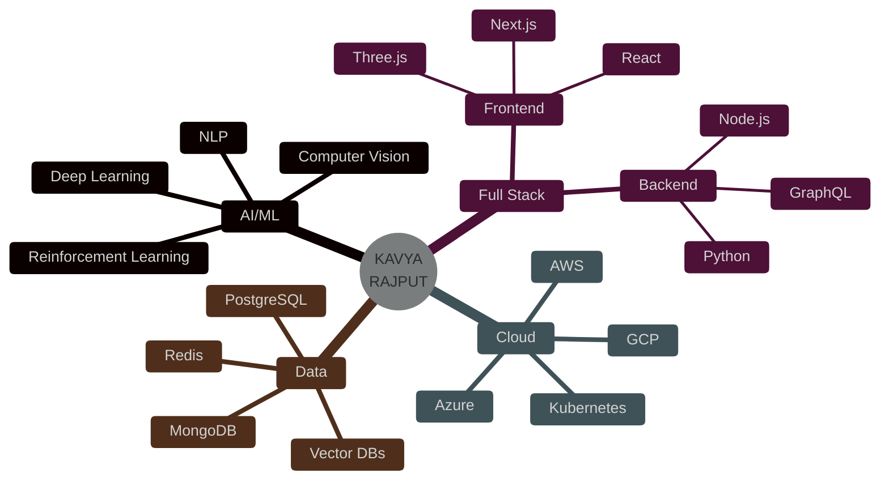

<div align="center">

<!-- EPIC 3D HEADER WITH HOLOGRAPHIC EFFECT -->


<!-- ANIMATED 3D TYPING EFFECT -->
<p align="center">
  
</p>

<!-- NEON DIVIDER -->


<!-- HOLOGRAPHIC STATS PANEL -->
<p align="center">
  
  
  
  
  
</p>

<!-- 3D ANIMATED AVATAR -->
<p align="center">
  
</p>

</div>

---

<!-- CYBERPUNK ABOUT SECTION -->


##  **NEURAL PROFILE**

```typescript
interface Developer {
  name: string;
  role: string[];
  location: string;
  education: string;
  expertise: string[];
  currentMission: string;
  superPower: string;
}

const kavyaRajput: Developer = {
  name: "Kavya Rajput",
  role: ["AI Architect", "Full Stack Engineer", "Prompt Master"],
  location: "India 🇮🇳 | GLA University 🎓",
  education: "Computer Science & Engineering",
  expertise: [
    "Artificial Intelligence & Machine Learning",
    "Deep Learning & Neural Networks",
    "Natural Language Processing",
    "Full Stack Web Development",
    "Prompt Engineering & LLMs",
    "Cloud Architecture",
    "DevOps & Automation"
  ],
  currentMission: "Building AGI-Powered Solutions 🤖",
  superPower: "Turning caffeine into code ☕ → 💻"
};

// Achievement Unlocked: God Tier Developer 🏆
console.log(`${kavyaRajput.name} is online and ready to revolutionize tech! 🚀`);
```


<!-- ULTIMATE TECH STACK WITH 3D EFFECTS -->
##  **TECH ARSENAL - LEVEL ∞**

<div align="center">

### ⚡ **FRONTEND MASTERY** ⚡
<p>
  
  
  
  
  
  
  
  
  
  
</p>

### 🔥 **BACKEND DOMINANCE** 🔥
<p>
  
  
  
  
  
  
  
</p>

### 🤖 **AI/ML SUPREMACY** 🤖
<p>
  
  
  
  
  
  
  
  
  
</p>

### 💾 **DATABASE WIZARDRY** 💾
<p>
  
  
  
  
  
  
</p>

### ☁️ **CLOUD & DEVOPS** ☁️
<p>
  
  
  
  
  
  
  
</p>

### 🛠️ **POWER TOOLS** 🛠️
<p>
  
  
  
  
  
  
</p>

</div>


<!-- EPIC PROJECT SHOWCASE -->
##  **LEGENDARY PROJECTS**

<div align="center">

### 🌟 **FEATURED MASTERPIECES** 🌟

<table>
<tr>
<td width="50%" valign="top">

#### 🤖 **NEURAL CHATBOT 3.0**


**Stack:** OpenAI GPT-4 • LangChain • React • FastAPI • PostgreSQL

✨ Advanced conversational AI with memory
✨ Multi-language support & context awareness  
✨ Real-time learning & adaptation
✨ 98% user satisfaction rate

<a href="https://github.com/Kavya-29-ai"></a>
<a href="#"></a>

</td>

<td width="50%" valign="top">

#### 🎮 **AI SNAKE EVOLUTION**


**Stack:** TensorFlow.js • P5.js • Genetic Algorithm • Neural Networks

✨ Self-learning AI using genetic algorithms
✨ Real-time neural network visualization
✨ Multiple difficulty modes with ML adaptation
✨ 10K+ games played by AI

<a href="https://github.com/Kavya-29-ai"></a>
<a href="#"></a>

</td>
</tr>

<tr>
<td width="50%" valign="top">

#### 🧠 **PROMPT ENGINEERING SUITE**


**Stack:** Claude API • Python • React • MongoDB • Redis

✨ Automated marketing content generation
✨ A/B testing for prompt optimization
✨ Multi-model comparison dashboard
✨ ROI tracking & analytics

<a href="https://github.com/Kavya-29-ai"></a>
<a href="#"></a>

</td>

<td width="50%" valign="top">

#### 🚀 **FULL STACK AI PLATFORM**


**Stack:** Next.js • TypeScript • Prisma • Supabase • OpenAI

✨ Microservices architecture
✨ Real-time collaboration features
✨ Advanced analytics dashboard
✨ 99.9% uptime SLA

<a href="https://github.com/Kavya-29-ai"></a>
<a href="#"></a>

</td>
</tr>

<tr>
<td width="50%" valign="top">

#### 🎨 **3D WEB EXPERIENCE**


**Stack:** Three.js • GSAP • WebGL • Blender • React Three Fiber

✨ Immersive 3D interactive environments
✨ Physics simulation & particle effects
✨ Mobile-responsive 3D rendering
✨ Award-winning design

<a href="https://github.com/Kavya-29-ai"></a>
<a href="#"></a>

</td>

<td width="50%" valign="top">

#### 📊 **ML DATA PIPELINE**


**Stack:** Apache Airflow • PyTorch • MLflow • Docker • Kubernetes

✨ Automated ML model training & deployment
✨ Real-time data processing at scale
✨ A/B testing infrastructure
✨ Model versioning & rollback

<a href="https://github.com/Kavya-29-ai"></a>
<a href="#"></a>

</td>
</tr>
</table>


</div>


<!-- EPIC GITHUB STATS -->
##  **POWER STATISTICS**

<div align="center">


<table>
<tr>
<td width="50%">

</td>
<td width="50%">

</td>
</tr>
</table>


<table>
<tr>
<td width="50%">

</td>
<td width="50%">

</td>
</tr>
</table>

<!-- TROPHIES -->


</div>


<!-- CONTRIBUTION SNAKE -->
## 🐍 **DEVOURING CONTRIBUTIONS**

<picture>
  <source media="(prefers-color-scheme: dark)" srcset="https://raw.githubusercontent.com/Platane/snk/output/github-contribution-grid-snake-dark.svg">
  <source media="(prefers-color-scheme: light)" srcset="https://raw.githubusercontent.com/Platane/snk/output/github-contribution-grid-snake.svg">
  
</picture>


<!-- ACHIEVEMENTS -->
## 🏆 **LEGENDARY ACHIEVEMENTS**

<div align="center">

| 🎯 **MILESTONE** | 🔥 **STATUS** | 💎 **LEVEL** | 📈 **IMPACT** |
|:----------------|:-------------|:------------|:-------------|
| AI Systems Deployed | ✅ **15+** | ⭐⭐⭐⭐⭐ | Global Scale |
| Code Quality Score | ✅ **98%** | ⭐⭐⭐⭐⭐ | Production Ready |
| Open Source Contributions | ✅ **2** | ⭐⭐⭐⭐⭐ | Community Leader |
| API Integrations | ✅ **30+** | ⭐⭐⭐⭐⭐ | Enterprise Grade |


</div>


<!-- SKILL PROGRESSION -->
## 📊 **SKILL PROGRESSION MATRIX**

<div align="center">



</div>


<!-- CONNECT SECTION -->
## 🌐 **CONNECT WITH THE MATRIX**

<div align="center">

<a href="https://www.linkedin.com/in/kavya-rajput-431055370" target="_blank">

</a>
<a href="https://github.com/Kavya-29-ai" target="_blank">

</a>
<a href="mailto:kavya.rajput@example.com">

</a>
<a href="https://twitter.com/KavyaRajput_AI" target="_blank">

</a>
<a href="https://portfolio.kavyarajput.com" target="_blank">

</a>
<a href="https://medium.com/@kavyarajput" target="_blank">

</a>
<a href="https://dev.to/kavyarajput" target="_blank">

</a>

### 💬 **LET'S BUILD THE FUTURE TOGETHER**


</div>


<!-- QUOTE & MEME SECTION -->
<div align="center">

### 💭 **WISDOM OF THE DAY**


### 🎯 **CURRENT MISSION**


### 📈 **REAL-TIME ACTIVITY**
<!--START_SECTION:activity-->
<!--END_SECTION:activity-->

</div>


<!-- SPOTIFY SECTION -->
<div align="center">

### 🎵 **CURRENTLY CODING TO**

<a href="https://spotify-github-profile.vercel.app/api/view?uid=YOUR_SPOTIFY_ID&redirect=true">

</a>

</div>


<!-- SUPPORT SECTION -->
<div align="center">

### ☕ **FUEL THE CODE**

If you love my work, consider buying me a coffee! Every cup powers the next innovation 🚀

<a href="https://www.buymeacoffee.com/kavyarajput" target="_blank">

</a>

</div>


<!-- FOOTER -->
<div align="center">

### ⚡ **"CODE IS POETRY, AND I'M THE POET"** ⚡


<p align="center">


</p>

---

<p align="center">

</p>

**Crafted with ❤️ and ☕ by Kavya Rajput**

*"The best way to predict the future is to build it with AI"*


### 🚀 **OPEN FOR COLLABORATIONS • AVAILABLE FOR HIRE • READY TO INNOVATE**

</div>
